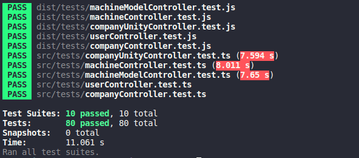

<h3 align="center">
  Backend <b>Freios Supremos<b>
</h3>

  <a href="#pushpin-test-drive">Test Drive</a>&nbsp;&nbsp;&nbsp;|&nbsp;&nbsp;&nbsp;
  <a href="#pushpin-ferramentas-utilizadas">Ferramentas Utilizadas</a>&nbsp;&nbsp;&nbsp;|&nbsp;&nbsp;&nbsp;
  <a href="#pushpin-endpoints">Endpoints</a>&nbsp;&nbsp;&nbsp;|&nbsp;&nbsp;&nbsp;
  <a href="#pushpin-testes">Testes</a>

## :pushpin: Test Drive
Voce pode testar a api clicando [aqui]().

## :pushpin: Ferramentas Utilizadas
* [Nodejs](https://nodejs.org/en/) -> Runtime JavaScript
* [Typescript](https://www.typescriptlang.org/) -> Superset JavaScript
* [Express](https://expressjs.com/pt-br/) -> Web Framework
* [Jest](https://jestjs.io/) -> Test runner
* [Ajv](https://ajv.js.org/) -> Validador de JSON

## :pushpin: Endpoints

### :small_blue_diamond: **Company**
* Content-Type: application/json

Method   | URI    | Body | Query      | Descricao
--------- | ------| ------- | ---------- | --------
POST | /company    | name |            | Cria uma nova empresa
GET | /company     ||            | Busca todas empresas
GET | /company/:id ||            | Busca empresa por id
PUT | /company/:id |name|            | Atualiza dados de uma empresa
DELETE | /company/:id ||         | Deleta uma empresa
_____

### :small_blue_diamond: **Company Unity**
* Content-Type: application/json

Method   | URI   | Body | Query | Descricao
--------- | ------ | ----- | ------ | -----
POST | /companyunity| name, address, company |      | Cria uma nova unidade
GET | /companyunity | | company     | Busca todas unidades (use a query company com o id para filtrar unidades de uma empresa)
GET | /companyunity/:id ||   | Busca unidade por id
PUT | /companyunity/:id| name, address, company |   | Atualiza dados de uma unidade
DELETE | /companyunity/:id| || Deleta uma unidade
POST   | /companyunity/:id/machines| | | Adiciona uma maquina (ativo) a uma unidade
DELETE | /companyunity/:id/machines/:machineId || | Remove uma maquina (ativo) de uma unidade
_____
### :small_blue_diamond: **Machine Model**
* Content-Type: application/json

Method   | URI   | Body | Query | Descricao
--------- | ------| ----- | ----- | ------
POST | /machinemodel | name, description |     | Cria uma novo modelo
GET | /machinemodel | |     | Busca todos os modelos
GET | /machinemodel/:id | |  | Busca modelo por id
PUT | /machinemodel/:id | name, description |   | Atualiza dados de um modelo
DELETE | /machinemodel/:id | || Delete um modelo 
_______
### :small_blue_diamond: **User**
* Content-Type: application/json

Method   | URI   | Body | Query   | Descricao
--------- | ------ | ----- | ----- | ------
POST | /user | name |           | Cria um novo usuario
GET | /user  |   |          | Busca todos os usuarios
GET | /user/:id | |         | Busca usuario por id
PUT | /user/:id | name |        | Atualiza dados de um usuario
DELETE | /user/:id | |      | Deleta um usuario
______
### :small_blue_diamond: **Machine**
* Content-Type: multipart/form-data

Method    | URI    | Body | Query      | Descricao
--------- | ------ | ------ | ------ | ------
POST | /machine | name, description, model, responsable, image (binario)  |        | Cria uma nova maquina (ativo)
GET | /machine  |   |        | Busca todas maquinas 
GET | /machine/:id | |       | Busca uma maquina por id
PUT | /machine/:id | name, description, model, responsable, image (binario) |      | Atualiza dados de uma maquina
DELETE | /machine/:id ||     | Deleta uma maquina
GET | /machine/:id/image ||  | Retorna imagem da maquina (ativo)

## :pushpin: Testes
Os testes podem ser executados executando o comando `npm test`
### Printscreen da execucao dos testes

---
<h4 align="center">
  
Feito por <b>Carlos Eduardo<b>

  <a href="https://www.linkedin.com/in/caeduob/"> Linkedin </a> | <a href="https://www.instagram.com/car_losed/">Instagram</a>   
  💜 
</h3>
